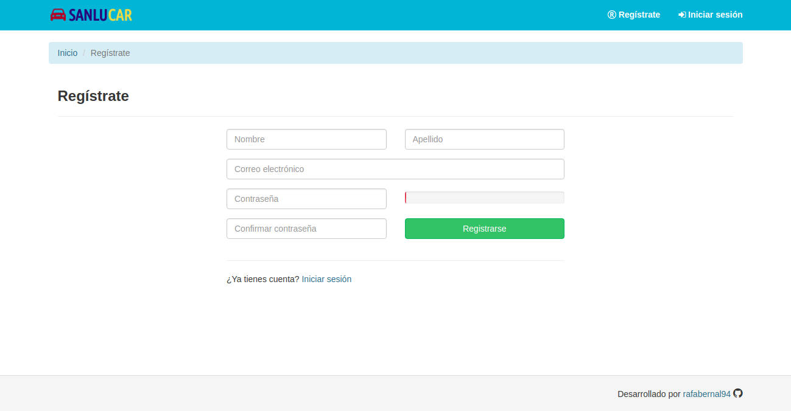
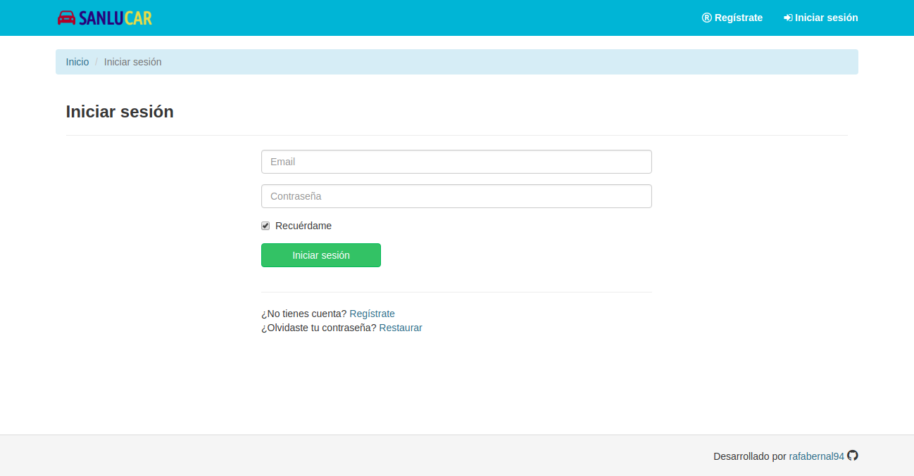
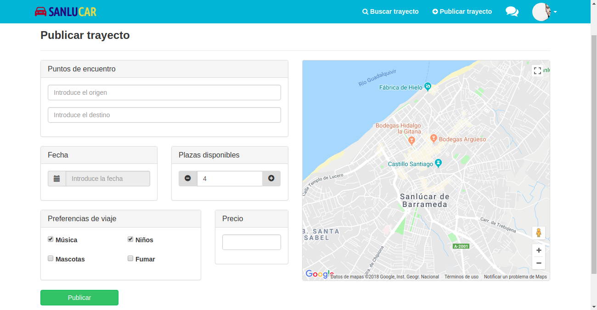
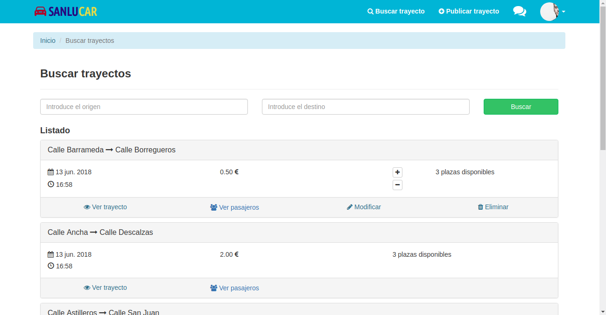
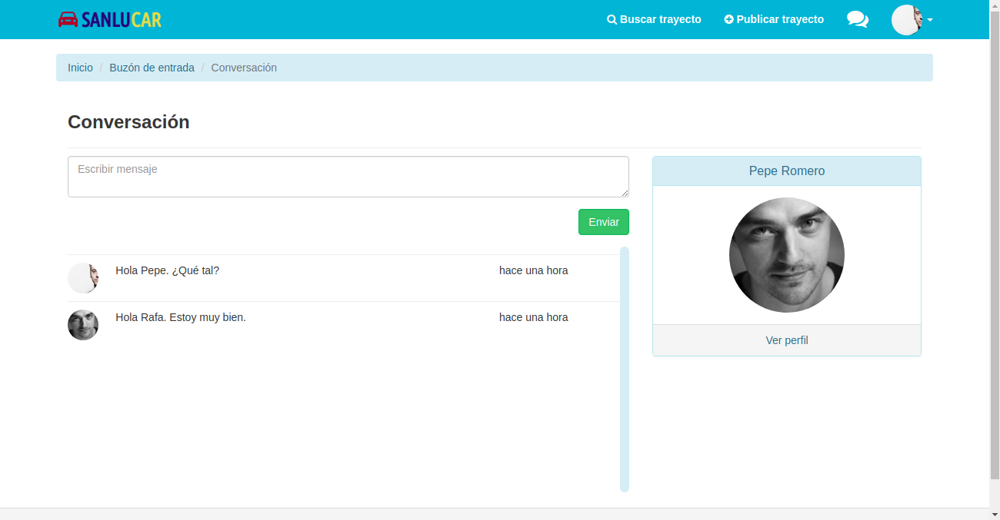
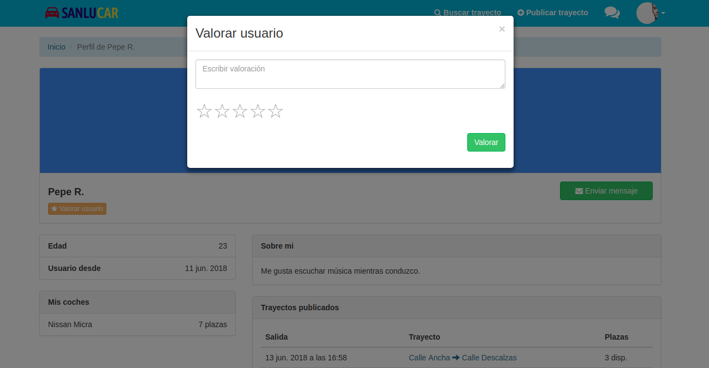

# Manual de usuario

## Registro
Para registrarnos en la aplicación debemos hacer click en la opción 'Regístrate', que se encuentra en la zona superior derecha de la barra de navegación. Tendremos que rellenar un formulario para poder registrarnos correctamente en la aplicación.

## Inicio de sesión
Una vez registrados y hayamos validado nuestra cuenta mediante el enlace que nos llegará a nuestro correo, podremos iniciar sesión en la aplicación haciendo click en la opción 'Iniciar sesión', que se encuentra en la zona superior derecha de la barra de navegación. Esta acción se realizará a través de un formulario donde debemos indicar nuestro correo electrónico y contraseña.

## Mi perfil
Desde la pantalla 'Mi perfil', podremos ver nuestra información personal. También tenemos la posibilidad de modificar nuestros datos pulsando el botón 'Editar perfil', eliminar nuestra cuenta pulsando el botón 'Darse de baja' y acceder a nuestras valoraciones pulsando el botón 'Mis valoraciones'.

## Modificar perfil
Desde esta pantalla tenemos la posibilidad de modificar nuestra información personal, foto de perfil y contraseña. Lo realizaremos pulsando en la diferentes opciones del menú vertical de la izquierda.

## Publicar trayecto
Una vez iniciada la sesión, tendremos la posibilidad de publicar un trayecto pulsando sobre la opcíon 'Publicar trayecto', que se encuentra en la barra superior de navegación. Para ello debemos rellenar un formulario indicando el origen y destino del trayecto, fecha, plazas disponibles, preferencias de viaje y precio del mismo.

## Modificar trayecto o eliminar trayecto
En la pantalla 'Mis trayectos' se mostrará un listado con nuestros trayectos publicados. Tendremos la opción de modificar los trayectos pulsando sobre el enlace 'Modificar' y a su vez, podremos eliminarlos si aún no existen pasajeros en el mismo, pulsando sobre enlace 'Eliminar'.

## Buscar trayecto
Tenemos la posibilidad de buscar trayectos pulsando sobre la opción 'Buscar trayectos', la cuál se encuentra en la barra superior de navegación. A través de un formulario indicando origen y destino, podremos realizar dichas búsquedas.

## Solicitar plaza
Si estamos interesados en participar en un trayecto y el vehículo aún no está completo, tendremos la posibilidad de solicitar una plaza pulsando sobre el botón 'Solicitar plaza' en la vista 'Detalles del trayecto'.

## Aceptar solicitud
Si has publicado un trayecto, recibirás solicitudes de unión de otros usuarios, las cuales podrás aceptar pulsando sobre el botón 'Aceptar solicitud' desde la pantalla 'Detalles' del mismo.

## Pagar trayecto o retirarse de un trayecto
Si han aceptado una de tus solicitudes de unión, para finalizar el proceso deberás realizar el pago pulsando sobre botón azul con el logo de PayPal, situado en la zona derecha, concretamente dentro de la caja 'Pasajeros'. También tendrás la posibilidad de salir de un trayecto pulsando sobre botón 'Retirarse', pero recuerda que si ya has pagado la plaza perderás el importe.

## Añadir coche
Para añadir un nuevo coche debemos rellenar un formulario indicando marca, modelo, plazas y matrícula del mismo.

## Modificar coche o eliminar coche
Desde la pantalla 'Mis coches' podremos ver un listado con todos nuestros coches. Tendremos la posibilidad de editar un coche pulsando sobre el botón editar (lápiz), podremos eliminarlo pulsando sobre el botón eliminar (papelera) y también marcarlo como favorito pulsando en el icono de la estrella.

## Buzón de entrada
Podremos acceder al buzón de entrada pulsando sobre la opción mensajes (icono de chats) que se encuentra en la barra superior de navegación. Veremos un listado con todos los usuarios con los cuáles tenemos una conversación abierta.

## Enviar mensaje
Haciendo click sobre una de las conversaciones de la imagen anterior, accederemos a la conversación donde se mostrarán los mensajes de la misma. En esta pantalla tendremos la posibilidad de enviar mensajes rellenando la caja de texto y pulsando sobre botón 'Enviar'.

## Valorar usuario
Desde la pantalla 'Perfil' de un usuario, podemos valorar al mismo haciendo click sobre el botón 'Valorar usuario'. Se realizará a través de un formulario indicando un mensaje y una puntuación (estrellas).

